<!------------------------------------------------------------>
<!--      GISDay UW 2014 - Getting into UAV’s for under $700--> 
<!--      and having fun every step of the way!             -->
<!--      Target talk time - 20 min + 5 min questions       -->
<!------------------------------------------------------------>

<!------------------------------------------------------------>
<!-- Topic: Title slide -->

<iframe width="640" height="480" src="https://sketchfab.com/models/6ea595564fcc4b82b372015c7a06e81b/embed" frameborder="0" allowfullscreen mozallowfullscreen="true" webkitallowfullscreen="true" onmousewheel=""></iframe>

<!--img style="max-height: 300px;" src="images/quadcopter_cover.png"-->
<h2>Getting into UAV’s for under $700</h2>
<h4>...and having fun every step of the way!</h4>

    <small>Aaron Racicot - <a href="mailto:aaronr@z-pulley.com">aaronr@z-pulley.com</a>
 
<a href="http://reprojected.com">reprojected.com</a> / <a href="http://twitter.com/reprojected">@reprojected</a> 
 
<a href="https://github.com/aaronr">github.com/aaronr</a>
  
<a href="http://aaronr.github.io/uw-gisday-2014">aaronr.github.io/uw-gisday-2014</a>
</small>

<!------------------------------------------------------------>
--SLIDE--
<!-- Topic: Introduce myself -->

  <h3>Computer Science (UW Alum!)</h3>
  <h2>Bridging the Gap</h2>
  <h3>Environmental Science</h3>

--SUBSLIDE--

<!------------------------------------------------------------>
--SLIDE--
<!-- Topic: How did we get here ... -->

How did we get here?

--SUBSLIDE--

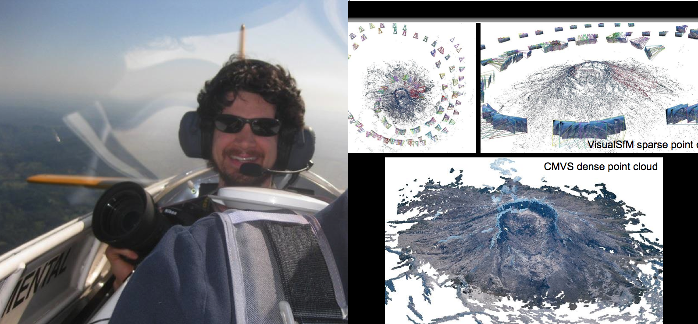
 
David Shean "Ice Man"
 
<small>http://psc.apl.washington.edu/wordpress/people/students/david-shean/</small>

--SUBSLIDE--

 
CUGOS "Google Guys"

--SUBSLIDE--

 
Video the bikes!

<!------------------------------------------------------------>
--SLIDE--
<!-- Topic: Hardware setup ... -->

Hardware options...

--SUBSLIDE--

 
Fully DIY

--SUBSLIDE--

 
Big Crazy Scary

--SUBSLIDE--

I choose low cost RTF (Ready To Fly) and then Hack It!

--SUBSLIDE--

 
Phantom FC40 (~$450)

--SUBSLIDE--

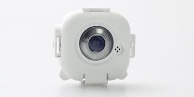
 
FPV camera (FC40)(720p)

--SUBSLIDE--

 
Canon (elph 130 16MP) downward facing (CHDK) (~$130)

--SUBSLIDE--

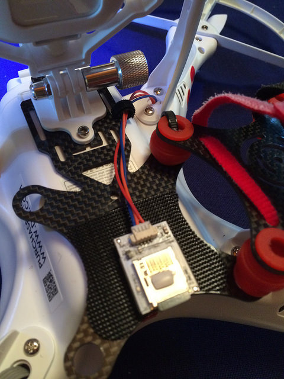
 
Flytrex Data Logger (~$50)

--SUBSLIDE--

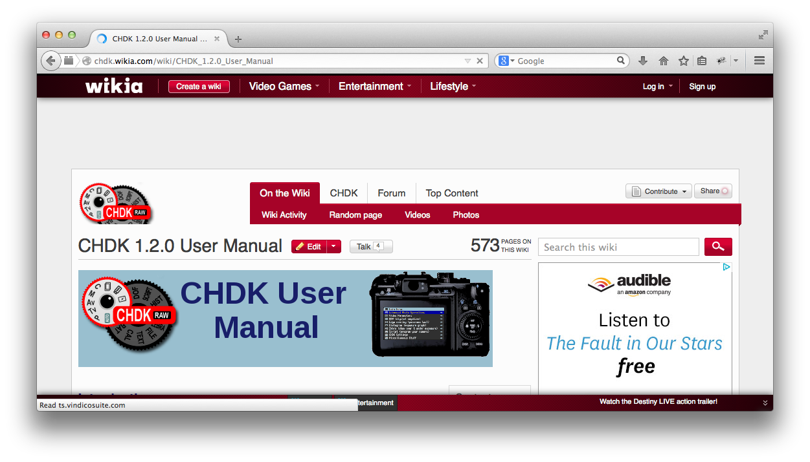
 
CHDK

--SUBSLIDE--

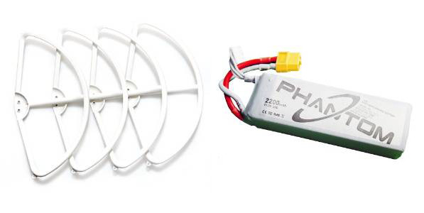
 
Prop Guards + Extra battery + Camera mount(~$50)

--SUBSLIDE--

 
"The Rig"

--SUBSLIDE--

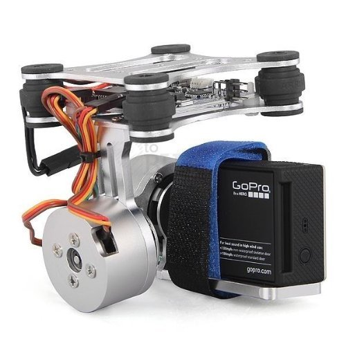
 
Gimbal

--SUBSLIDE--

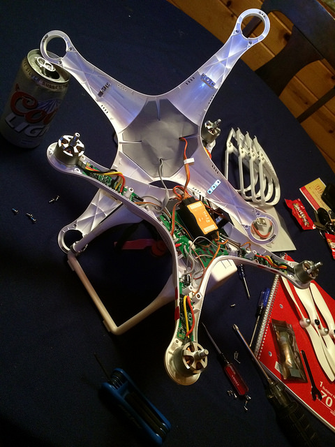
 
Hack

<!------------------------------------------------------------>
--SLIDE--
<!-- Topic: Why is this so interesting now ... -->

Why is this so interesting now...

$$$$$ Cheap $$$$$

--SUBSLIDE--

 
Technology is easy to use

--SUBSLIDE--

<h1>FUN!</h1>

<!------------------------------------------------------------>
--SLIDE--
<!-- Topic: Is it legal ... -->

<iframe width="100%" height="500px" frameBorder="0" src="https://www.mapbox.com/drone/no-fly/#10/45.4818/-122.6658"></iframe>
Where is it OK to fly
 
https://www.mapbox.com/drone/no-fly/

--SUBSLIDE--

<!------------------------------------------------------------>
--SLIDE--
<!-- Topic: Example captured before talk ... -->

<iframe width="560" height="315" src="//www.youtube.com/embed/8q7gg41LHik?list=UU1gRk1Hq5i97tCpto0E7Reg" frameborder="0" allowfullscreen></iframe>
 
Video taken a few minutes before talk...

<!------------------------------------------------------------>
--SLIDE--
<!-- Topic: Interesting workflows ... -->

<h2>Workflow #1</h2>
Panoramic image stitching

--SUBSLIDE--

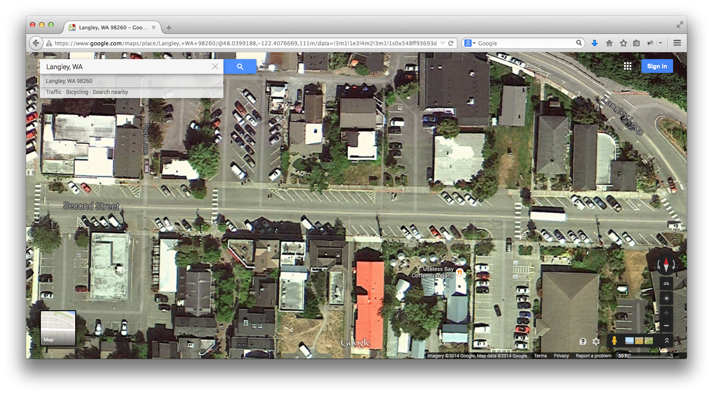
 
... as good as Google gets

--SUBSLIDE--

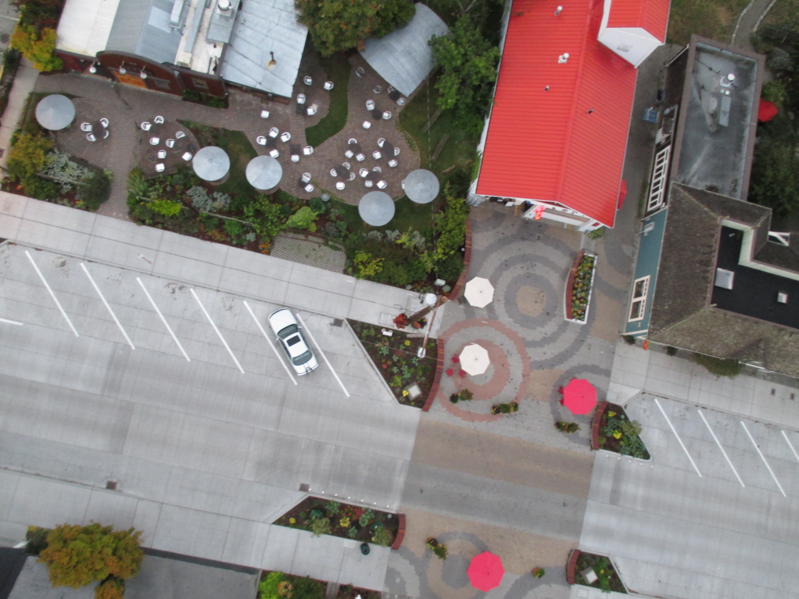
 
200 of these

--SUBSLIDE--

 
ICE

--SUBSLIDE--

--SUBSLIDE--

 
AgiSoft

--SUBSLIDE--

<!------------------------------------------------------------>
--SLIDE--
<!-- Topic: Interesting workflows ... -->

<h2>Workflow #2</h2>
OSM data creation / Web Maps

--SUBSLIDE--

 
QGIS Warper

--SUBSLIDE--

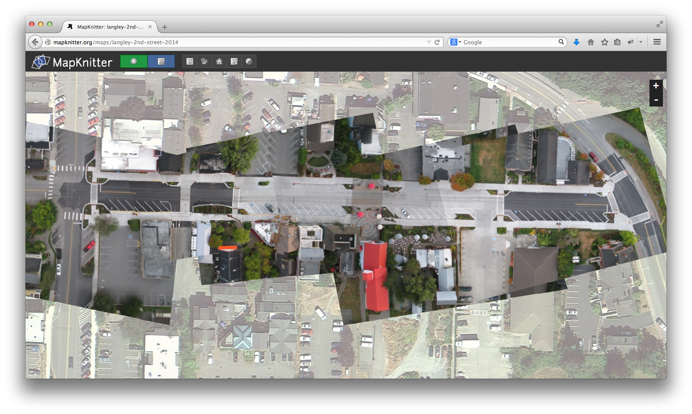
 
MapKnitter
http://mapknitter.org/

--SUBSLIDE--

 

--SUBSLIDE--

<pre><code>
nearblack -of GTiff -setalpha -o outfile infile
</code></pre>

--SUBSLIDE--

<pre><code>
gdal2tiles.py --profile=mercator -z 1-22 yourmap.tif outputfolder
</code></pre>

--SUBSLIDE--

<pre><code>
git checkout gh-pages
git add outputfolder
git commit -m "Yes... TILE DATA"
git push
</code></pre>

--SUBSLIDE--

http://langleywa.github.io/gisdata/tiles/langley-2nd-street-2014/21/335500/1368498.png
 

--SUBSLIDE--

 
Tiles into your App!

--SUBSLIDE--

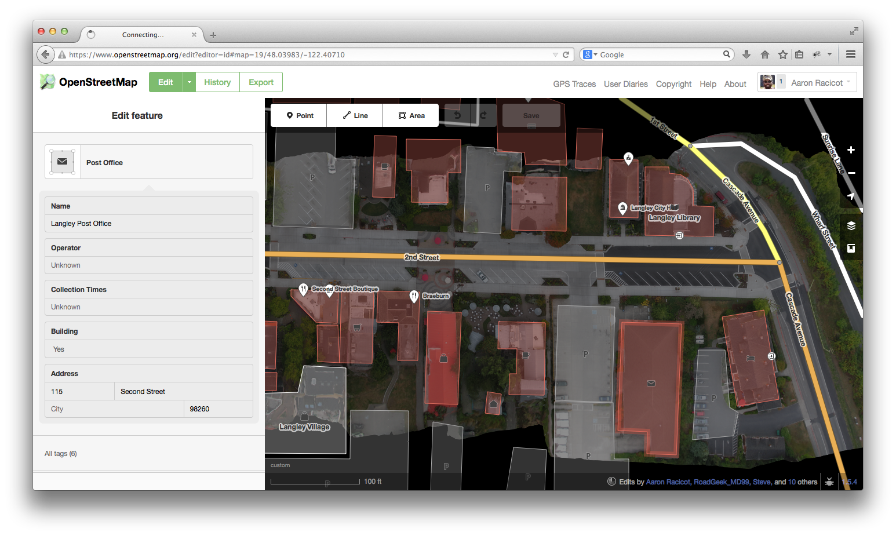
 
Edit in OSM
http://ideditor.com/
https://www.openstreetmap.org/edit?editor=id#map=19/48.03979/-122.40668
<small>http://langleywa.github.io/gisdata/tiles/langley-2nd-street-2014-tms/{z}/{x}/{y}.png</small>

<!------------------------------------------------------------>
--SLIDE--
<!-- Topic: Interesting workflows ... -->

<h2>Workflow #3</h2>
3D from Structure from Motion (SFM)

--SUBSLIDE--

 
Load image batches

--SUBSLIDE--

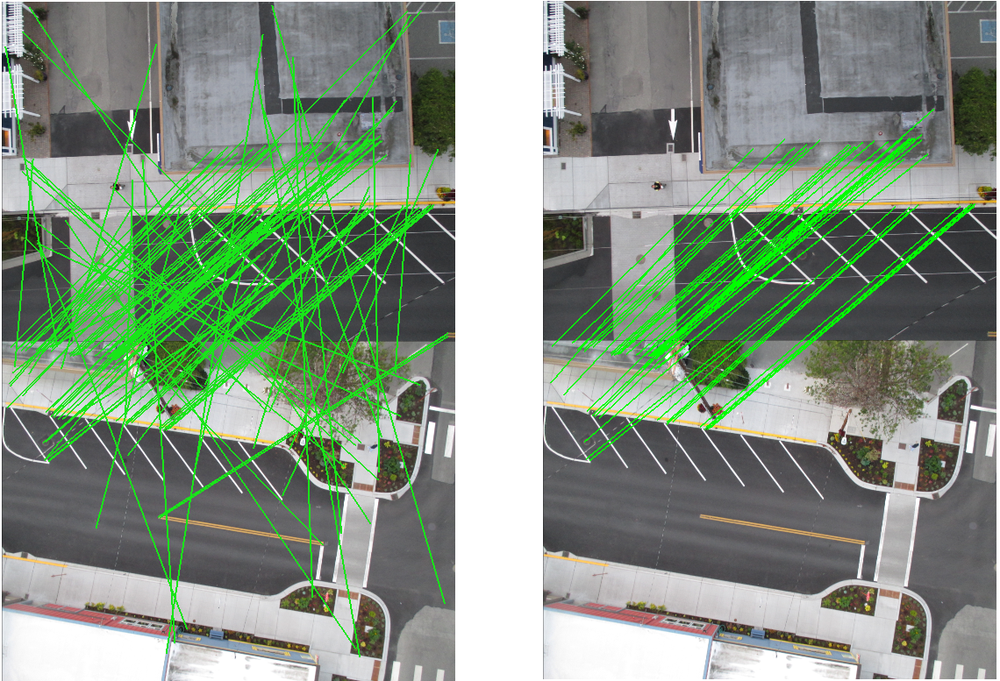
 
Matching

--SUBSLIDE--

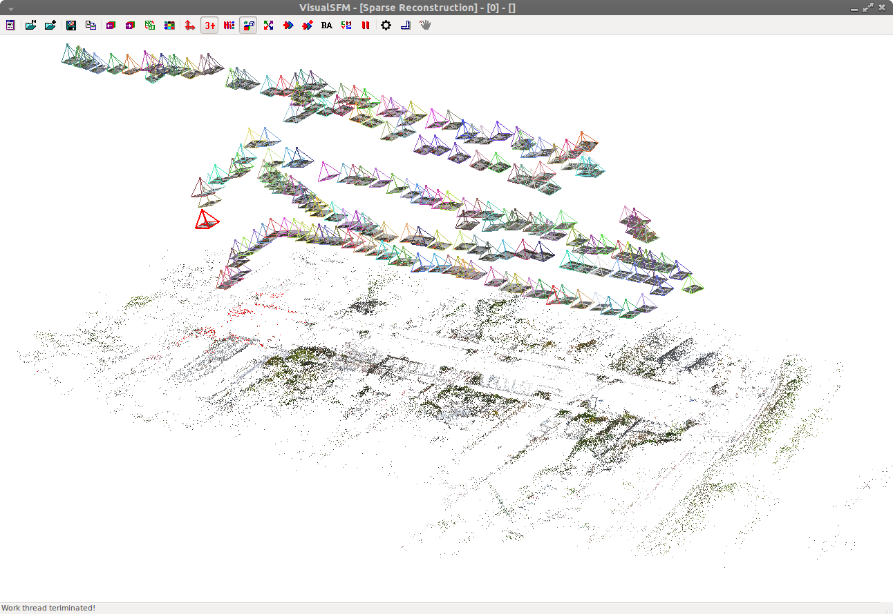
 
Visual SFM
 
Sparse Point Cloud

--SUBSLIDE--

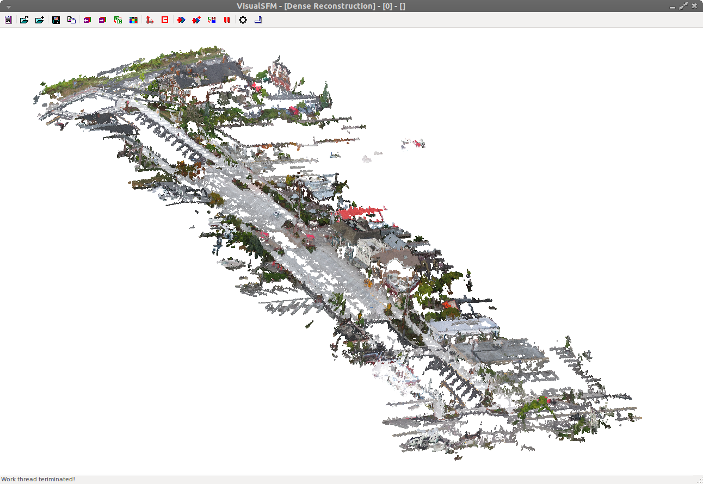
 
Dense Point Cloud

--SUBSLIDE--

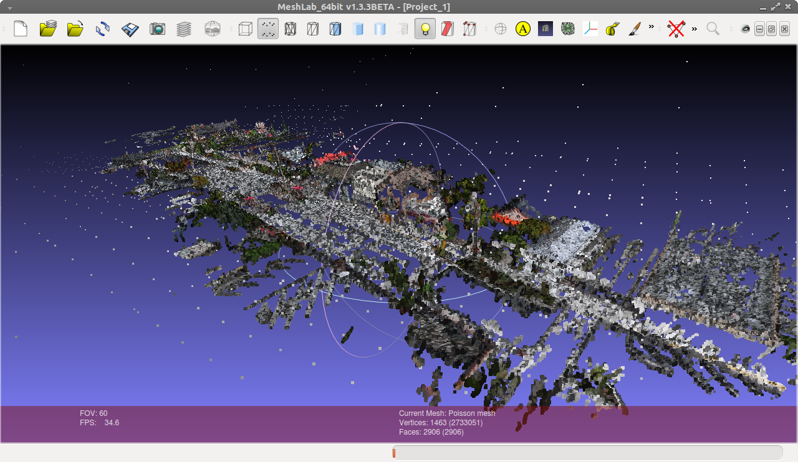
 
MeshLab

--SUBSLIDE--

--SUBSLIDE--

 
AgiSoft
 
Sparse Point Cloud

--SUBSLIDE--

 
Dense Point Cloud

--SUBSLIDE--

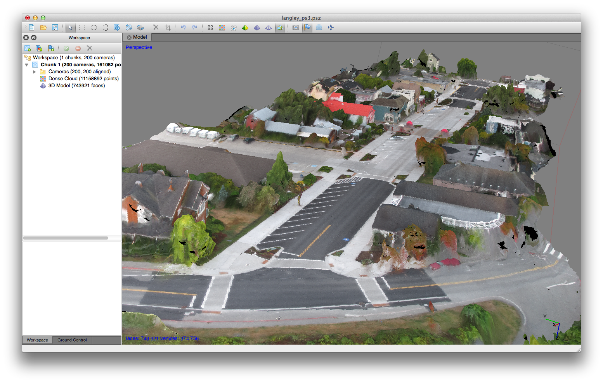
 
Textured Mesh

<!------------------------------------------------------------>
--SLIDE--
<!-- Topic: Examples ... -->

<h2>More Examples</h2>

--SUBSLIDE--

 
Flying Brightwater Treatment Plant

--SUBSLIDE--

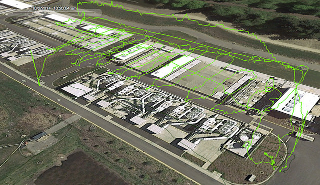
 
Flight Paths

--SUBSLIDE--

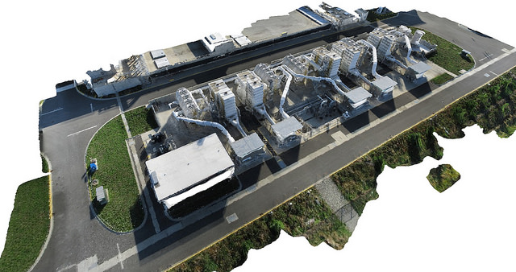
 
Photoscan SFM Rendering

--SUBSLIDE--

 
Chewy

--SUBSLIDE--

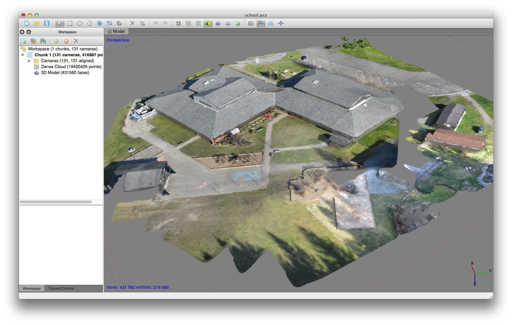
 
School

--SUBSLIDE--

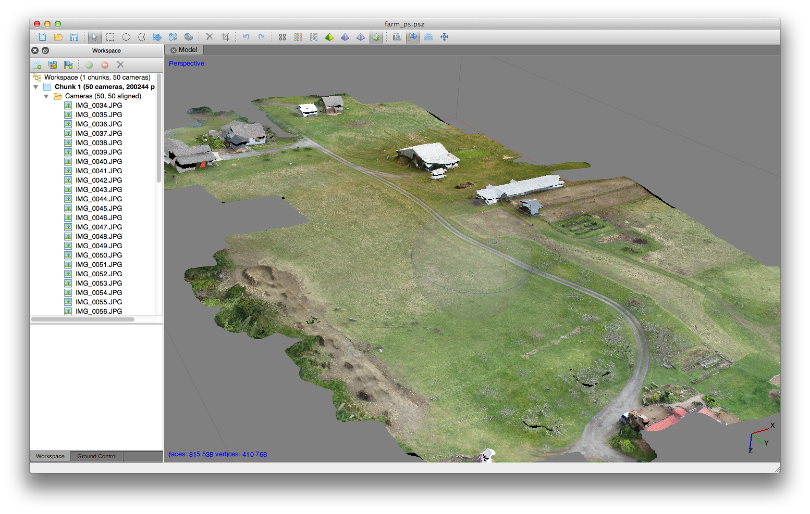
 
Farm

--SUBSLIDE--

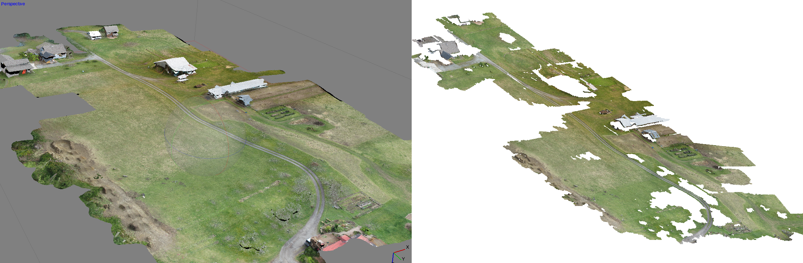
 
Compare (PhotoScan vs VSFM)

<!------------------------------------------------------------>
--SLIDE--
<!-- Topic: Future ... -->

<h2>The Future</h2>
Automation, DEM's, 3D printing, etc

--SUBSLIDE--

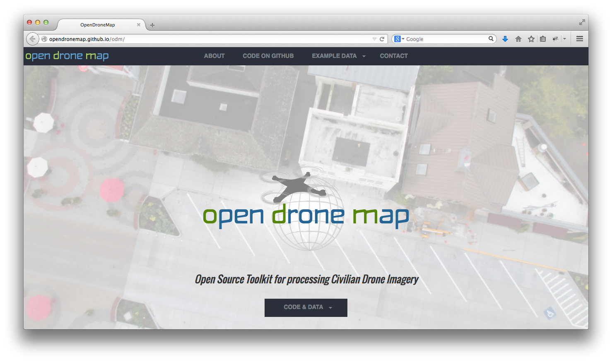
 
Automation (OpenDroneMap)

--SUBSLIDE--

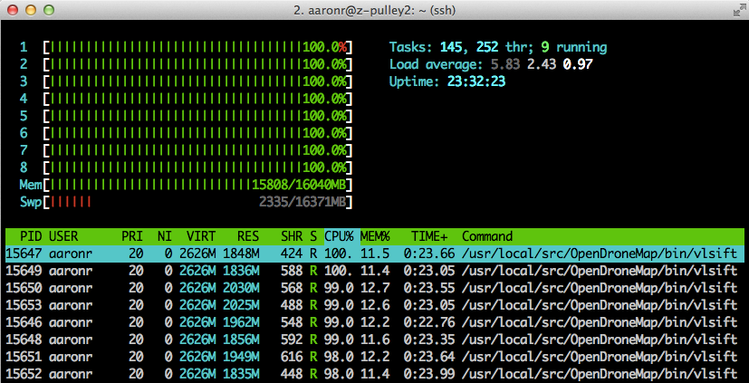
 
OpenDroneMap working hard!

--SUBSLIDE--

 
DEM's

--SUBSLIDE--

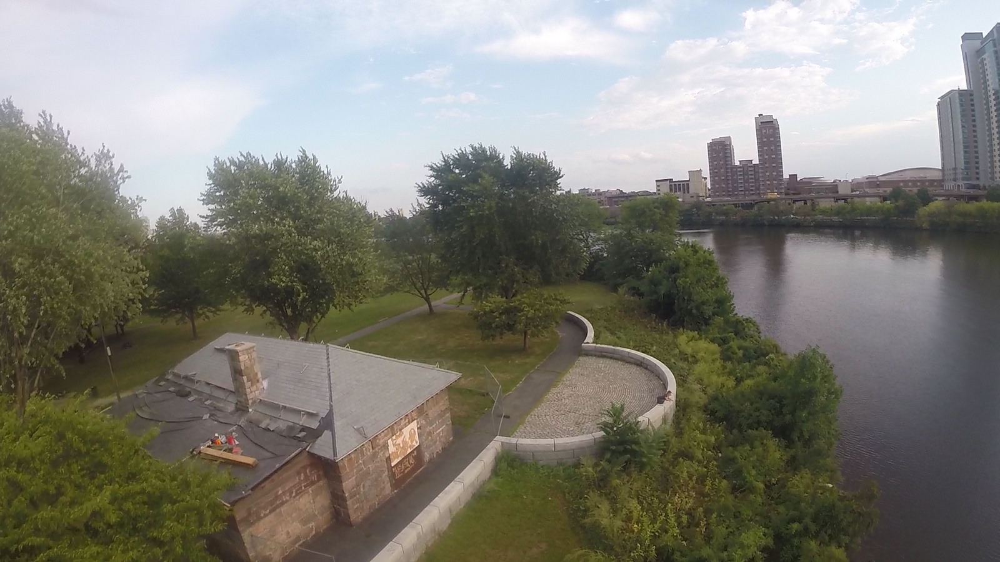
 
3D Print Example (Chris Schmidt)

--SUBSLIDE--

 
Point Cloud

--SUBSLIDE--

 
Mesh

--SUBSLIDE--

 
Print Prep

--SUBSLIDE--

 
Print!

<!------------------------------------------------------------>
--SLIDE--
<!-- Topic: Thank You -->

<h1>Thank You !!!</h1>

